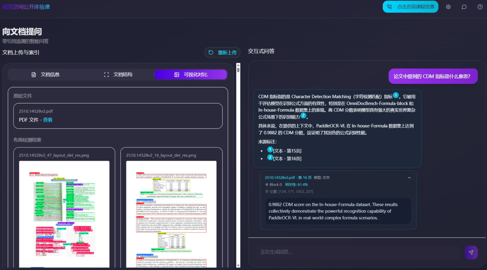

<div align="center">
  <h1>🚀 PaddleOCR 可溯源多模态 RAG 系统</h1>
  <p><em>基于 PaddleOCR-VL 构建 | 让每个答案都有迹可循</em></p>
  <span>中文 | <a href="./README.md">English</a></span>
</div>

## ⚡ 项目简介

本项目是基于 **PaddleOCR-VL** 构建的可溯源多模态RAG系统。采用 FastAPI 后端 + React 前端的架构。



该系统可高效处理 PDF 、图片等文件，具备强大 OCR 能力，支持图表解析、公式识别等复杂版面理解，并提供 RAG 可溯源引用能力。

## 🎯 主要功能

### 🔍 多模态精确解析
- 支持复杂架构图、工程图自动解析
- 手写图纸与扫描件元素精准识别
- PDF 图像与公式分类解析
- 识别结果附带坐标信息

### 📚 RAG 索引
- 超大复杂 PDF 在线索引构建
- 可单独索引普通文本块、LaTeX 复杂公式与 HTML 表格数据
- 独立拆分图像内各类元素

### 💬 问答与溯源
- 支持多模态 RAG 知识库多轮问答
- 坐标级细粒度问答溯源展示

### 🎨 可视化与交互
- 前端实时更新图片解析进度
- 动态渲染文档解析结构
- 在线预览图文布局识别结果

## 👀 项目演示


https://github.com/user-attachments/assets/1bae045a-0278-4c11-8c66-b98e37c9bd39


## 🚀 使用指南

### 系统要求


- **操作系统**：需要在 Linux 系统下运行
- **Python**：推荐使用 3.11 版本
- **Node.js**：≥ 18.0
- **GPU**：推荐 8GB+ ; CUDA 12.6


### 快速开始
#### 方法一、脚本一键启动（推荐）
将 `backend/.env` 中的 `DASHSCOPE_API_KEY` 替换为你自己的 API 密钥。
```bash
bash install_all.sh
bash start_all.sh
```
#### 方法二、手动安装

##### 1. 环境准备

确保系统已安装以下软件：
- **Conda**：Miniconda 或 Anaconda
- **Node.js**：≥ 18.0
- **CUDA**：12.6（用于 GPU 加速）

##### 2. 创建虚拟环境

```bash
# 创建 Conda 虚拟环境
conda create -n ocr_rag python=3.11 -y

# 激活环境
conda activate ocr_rag
```

##### 3. 安装 PaddlePaddle 和 OCR 依赖

```bash
# 安装 PaddlePaddle GPU 版本（CUDA 12.6）
python -m pip install paddlepaddle-gpu==3.2.0 -i https://www.paddlepaddle.org.cn/packages/stable/cu126/

# 安装 safetensors
python -m pip install https://paddle-whl.bj.bcebos.com/nightly/cu126/safetensors/safetensors-0.6.2.dev0-cp38-abi3-linux_x86_64.whl

# 安装 PaddleOCR 完整版
python -m pip install "paddleocr[all]"
```

##### 4. 下载 PaddleOCR-VL 模型

```bash
# 安装 ModelScope
pip install modelscope

# 下载模型文件
python download_paddleocr_vl.py
```

##### 5. 安装后端依赖

```bash
# 进入后端目录
cd ./backend

# 安装 Python 依赖
pip install -r requirements.txt
```

##### 6. 安装前端依赖

```bash
# 进入前端目录
cd ../frontend

# 安装 Node.js 依赖
npm install
```

##### 7. 启动服务

**启动后端服务：**
```bash
# 在 backend 目录下
python start_backend.py
```
后端将在 `http://localhost:8000` 启动

**启动前端服务：**
```bash
# 在 frontend 目录下，新开一个终端
PORT=3001 npm run dev
```
前端将在 `http://localhost:3001` 启动

## 🙈 贡献
欢迎通过GitHub提交 PR 或者issues来对项目进行贡献。我们非常欢迎任何形式的贡献，包括功能改进、bug修复或是文档优化。

## 😎 技术交流
探索我们的技术社区 👉 [大模型技术社区丨赋范空间](https://kq4b3vgg5b.feishu.cn/wiki/JuJSwfbwmiwvbqkiQ7LcN1N1nhd)

扫描添加小可爱，回复“PanddleOCR-RAG”加入技术交流群，与其他小伙伴一起交流学习。
<div align="center">

<div>

